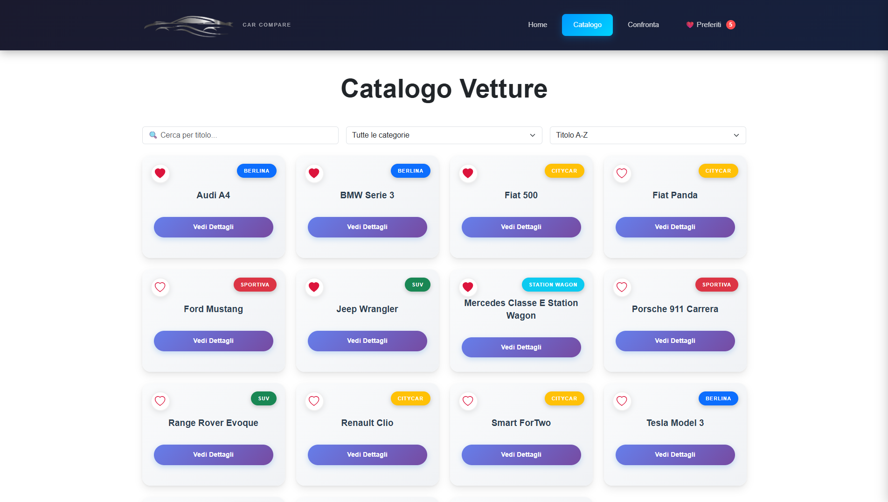
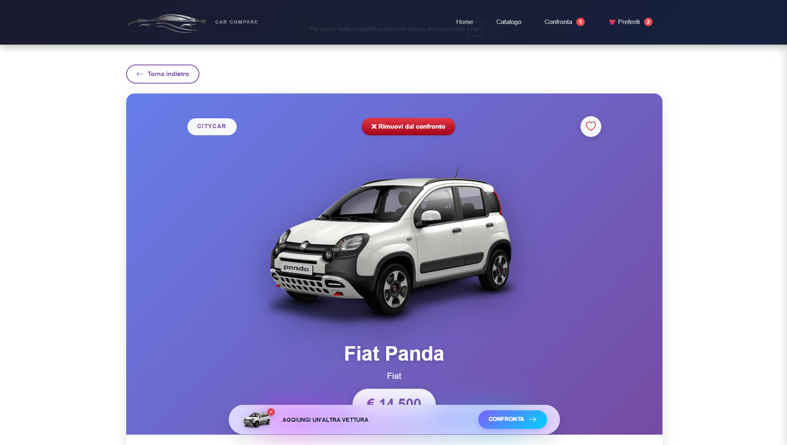
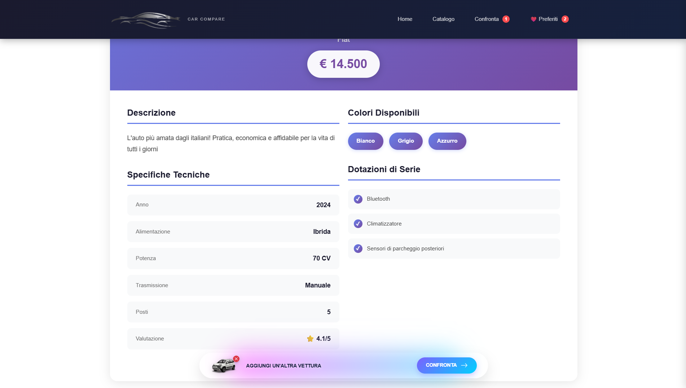
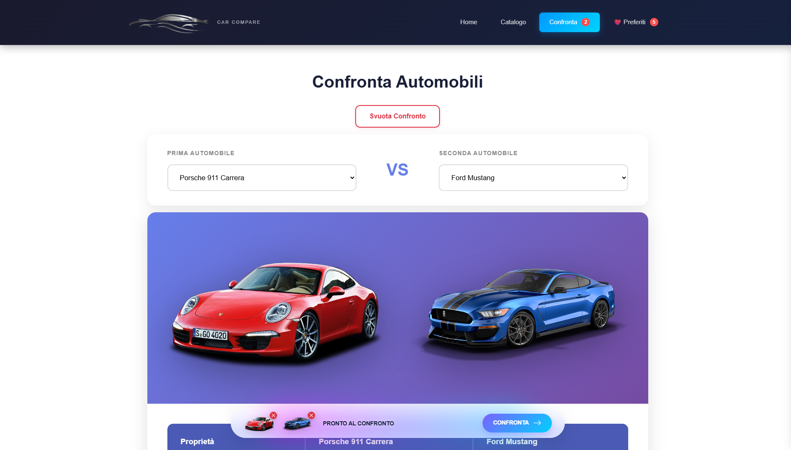
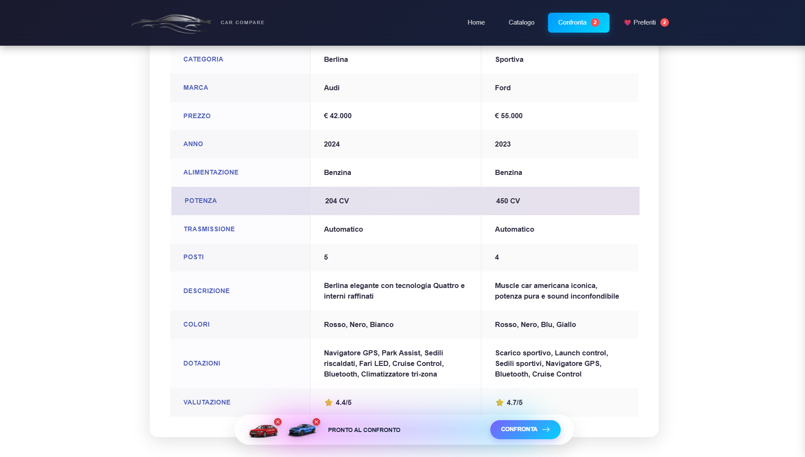

# CarCompare
**React Web Application for Car Comparison**

CarCompare è un'applicazione web frontend moderna sviluppata in React per esplorare, confrontare e visualizzare dettagli tecnici di automobili. Offre un'interfaccia utente intuitiva e completamente responsive per desktop, tablet e mobile. 

Progetto finale del corso **Boolean**, implementa best practices frontend, gestione stato globale tramite Context API e integrazione con API esterne.

---

## Obiettivo del Progetto

Creare uno strumento pratico per aiutare gli utenti nella scelta dell'auto ideale confrontando specifiche tecniche, prezzi e dotazioni.

**Funzionalità principali:**
- Ricerca e filtraggio avanzato delle automobili
- Confronto diretto tra massimo 2 modelli
- Visualizzazione dettagliata con specifiche tecniche
- Sistema preferiti persistente (localStorage)
- Interfaccia completamente responsive

---

## Screenshots

### Homepage


### Catalogo Auto


### Dettaglio Auto



### Confronto Auto



### Mobile Responsive


---

## Tecnologie Stack

### Frontend

- React 18+ - Componenti e Hooks
- React Router - Navigazione SPA
- Vite - Build tool e dev server
- React Bootstrap - UI Components e styling
- Bootstrap Icons - Iconografia
- ESLint - Code quality


### API & State Management

- Context API - Gestione stato globale
- Custom Hooks - Fetch API con error handling
- localStorage - Persistenza preferiti
- VITE_API_URL - Configurazione esterna


---

## Requisiti di Sistema

- Node.js 18+ (LTS raccomandato)
- npm 9+ o yarn
- Moderno browser (Chrome, Firefox, Safari)

---

## Installazione & Avvio

```bash
# Clona il repository
git clone <tuo-repo-url>
cd carcompare

# Installa dipendenze
npm install

# Avvia in sviluppo (localhost:5173)
npm run dev

# Build produzione
npm run build

# Preview build
npm run preview

# Lint code
npm run lint
```


## Funzionalità Implementate

**Catalogo Auto**
- Lista auto con filtri (marca, prezzo, categoria)
- Ordinamento (prezzo, potenza, anno)
- Lazy loading immagini
- Pagination

**Dettaglio Auto**
- Galleria immagini colori disponibili
- Specifiche tecniche dettagliate
- Lista optional e dotazioni
- Pulsante "Aggiungi ai preferiti"

**Sistema Preferiti**
- Persistenza automatica localStorage
- Badge counter nella navbar
- Rimozione rapida

**Confronto Auto**
- Drag & drop o selezione manuale
- Tabella comparativa side-by-side
- Barra flottante persistente
- Reset confronto

**Performance & UX**
- Loading states ottimizzati
- Error boundaries
- Responsive breakpoints (xs, sm, md, lg, xl)
- SEO friendly routing
